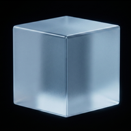
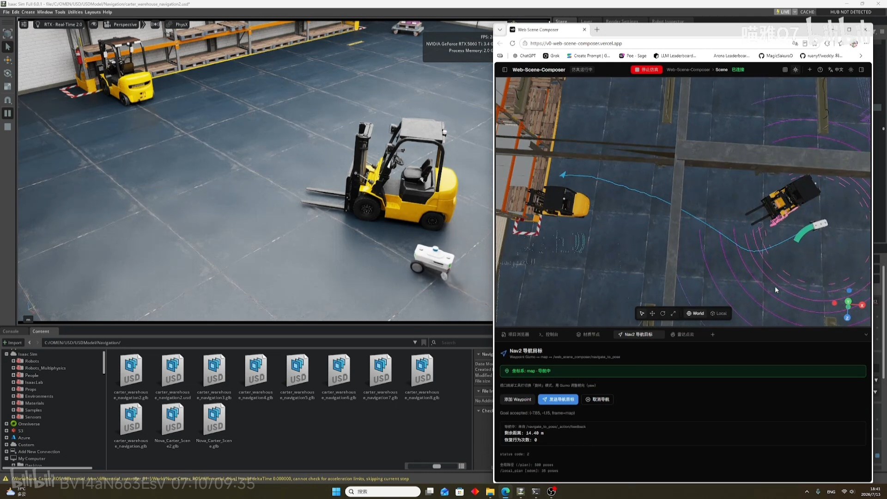
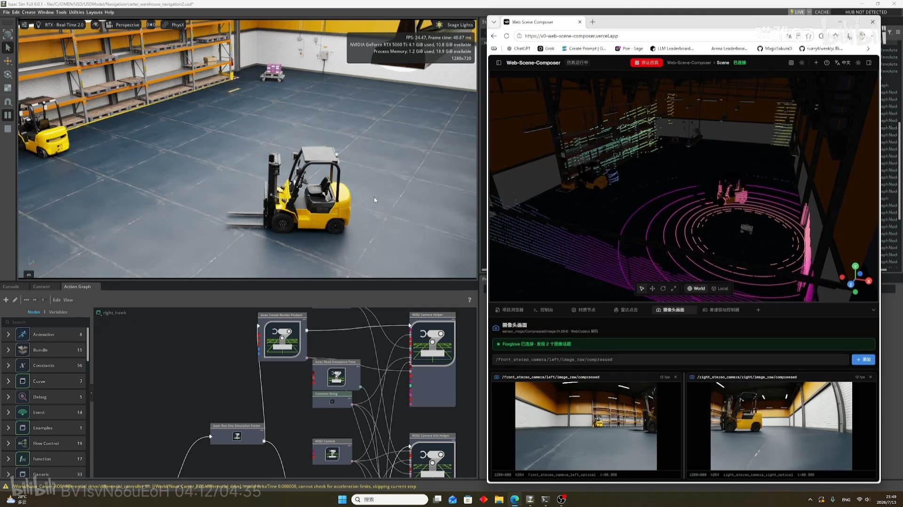
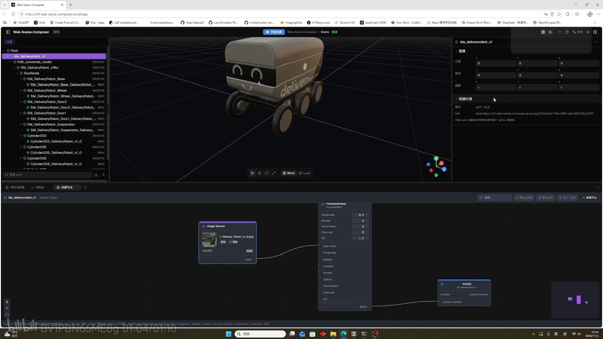

# Web Scene Composer

<p align="center">
  
</p>

**Web Scene Composer V1.0** 是面向 **Isaac Sim / ROS 2（Nova Carter）** 的浏览器端 **场景组装器与仿真联调前端**。

在 Web 中组装 glTF 场景、连接 Foxglove Bridge，完成 **Nav2 导航发目标**、**Xbox 差速 `/cmd_vel` 遥控**，并实时查看相机、LiDAR 与规划路径。定位是联调与可视化，而不是替代 Blender 的建模或材质工作站。

> **联调为核 · 组装为本 · 材质为辅** — 轻量仿真侧数字孪生可视化（浏览器中的位姿 / 传感器 / 导航与 Isaac·Nav2 对齐），不是企业级数字孪生平台。

在线预览（Vercel）：合并到 `main` 后自动部署。

---

## 功能演示

### Nav2 导航联调

Waypoint Gizmo → 桥接 Service → `/navigate_to_pose`；视口叠加 `/plan`、`/local_plan`。

[](https://www.bilibili.com/video/BV14aN663EsV/)

📺 [开发日志：Nav2 导航演示](https://www.bilibili.com/video/BV14aN663EsV/)

### Xbox 差速轮控制

手柄 → advertise / publish `/cmd_vel`，与 Simulate 下底盘位姿、TF 轮子同步配合使用。

[](https://www.bilibili.com/video/BV1svN66uEoH/)

📺 [开发日志：Xbox 手柄控制演示](https://www.bilibili.com/video/BV1svN66uEoH/)

### 材质节点预览（辅）

WebGPU TSL Shader Graph，便于视口内快速试材质；完整 shading 仍建议在 Blender 等 DCC 中完成。

[](https://www.bilibili.com/video/BV1PBN66ME8g/)

📺 [开发日志：材质预览演示](https://www.bilibili.com/video/BV1PBN66ME8g/)

---

## 功能概览

| 层级 | 能力 | 说明 |
|------|------|------|
| **核心** | Simulate | Foxglove Bridge：`/chassis/odom`（底盘）、`/tf`（轮子 / 脚轮） |
| **核心** | Nav2 导航目标 | Waypoint → Service 桥 → `/navigate_to_pose`；视口绘制全局 / 局部路径 |
| **核心** | 差速驱动 | Xbox 手柄 → `/cmd_vel` |
| **核心** | 传感器面板 | 摄像头（CompressedImage / H.264）、LiDAR（PointCloud2，视口叠加） |
| **基础** | 场景组装 | glTF 导入、prim 树、Transform Gizmo、导出选中物体 `.glb` |
| **辅助** | 材质节点 | TSL Shader Graph（探索用）；glTF 材质导出仍不完善（见下方） |
| — | 检视器 / 项目浏览器 | Transform、灯光、Asset / Prim；资源列表 |

界面支持 **中文 / English**（标题栏语言按钮）。

---

## 本地开发

```bash
npm install
npm run dev
```

浏览器打开 [http://localhost:3000](http://localhost:3000)。

```bash
pnpm install && pnpm dev
```

> **Vercel 部署**：仓库使用 `pnpm-lock.yaml`，请与 `package.json` 保持同步（`pnpm install` 后提交 lockfile）。

---

## 与 Isaac Sim 联调

完整 **Windows 六终端启动顺序**（Zenoh → Isaac Sim → Foxglove → Nav2 → 本桥接 → `npm run dev`）见：

**[ros/carter_web_nav_bridge/README.md](ros/carter_web_nav_bridge/README.md)**

### 快速检查清单

| 终端 | 命令（`jazzy_ws` 目录） |
|------|-------------------------|
| 1 | `pixi run zenoh` |
| 2 | `ros2 launch isaacsim_bringup run_isaacsim.launch.py install_path:=C:/isaacsim-6.0.1` → **Play** |
| 3 | `pixi run ros2 run foxglove_bridge foxglove_bridge --ros-args -p include_hidden:=true` |
| 4 | `ros2 launch carter_navigation carter_navigation.launch.py use_rviz:=False` |
| 5 | `ros2 launch carter_web_nav_bridge web_nav_bridge.launch.py` |
| 6 | `cd Web-Scene-Composer` → `npm run dev` → 浏览器 **Simulate** |

### 1. 启动仿真并确认 ROS 2 话题

在 Isaac Sim 的 ROS 2 workspace（示例：`jazzy_ws`）中确认话题已发布：

```powershell
ros2 topic list
```

当前 Nova Carter / Isaac Sim 输出话题如下：

| 话题 | 类型 / 用途 | Web Scene Composer |
|------|-------------|-------------------|
| `/front_stereo_camera/left/image_raw` | 相机图像 | 摄像头面板（需手动添加话题） |
| `/front_stereo_camera/left/camera_info` | 相机内参 | — |
| `/back_stereo_camera/left/image_raw` | 后视相机 | 摄像头面板 |
| `/back_stereo_camera/left/camera_info` | 相机内参 | — |
| `/front_3d_lidar/lidar_points` | PointCloud2 | **雷达面板 / 3D 视口点云**（默认） |
| `/chassis/odom` | Odometry | **Simulate** 订阅，驱动底盘位姿 |
| `/cmd_vel` | geometry_msgs/Twist | **差速驱动面板** publish |
| `/chassis/imu` | IMU | — |
| `/front_stereo_imu/imu` | IMU | — |
| `/back_stereo_imu/imu` | IMU | — |
| `/left_stereo_imu/imu` | IMU | — |
| `/right_stereo_imu/imu` | IMU | — |
| `/tf` | TF 树 | **Simulate** 订阅，驱动轮子 / 万向轮关节 |
| `/plan` / `/plan_smoothed` | `nav_msgs/Path` | **Nav Goal** 全局路径（视口） |
| `/local_plan` | `nav_msgs/Path` | **Nav Goal** 局部路径（视口） |
| `/navigate_to_pose/_action/feedback` | action feedback | **Nav Goal** 剩余距离（hidden） |
| `/navigate_to_pose/_action/status` | action status | **Nav Goal** 导航状态（hidden） |
| `/parameter_events` | 参数事件 | — |

> 若相机话题为 `image_raw`（非 `compressed`），请在底部 **摄像头画面** 面板中添加对应话题；代码内默认示例为 `image_raw/compressed`，与当前 Isaac Sim 输出可能不一致。

### 2. Foxglove Bridge 与导航桥接

须与 Zenoh、Nav2、本桥接节点一并启动，详见 [ros/carter_web_nav_bridge/README.md](ros/carter_web_nav_bridge/README.md)。

Foxglove（终端 3）：

```powershell
pixi run ros2 run foxglove_bridge foxglove_bridge --ros-args -p include_hidden:=true
```

导航 Service 桥接（终端 5）：

```powershell
ros2 launch carter_web_nav_bridge web_nav_bridge.launch.py
```

Web 端连接地址（见 `lib/ros/foxglove-config.ts`）：

```
ws://127.0.0.1:8765
```

Windows 上优先使用 `127.0.0.1`，避免 `localhost` 解析到 IPv6 导致握手失败。

### 3. 在 Web 端连接

1. 点击标题栏 **Simulate**，连接 Foxglove Bridge。
2. 连接成功后订阅 `/chassis/odom`（底盘）与 `/tf`（轮子），场景中的机器人会跟随仿真更新。
3. 底部 **+** 添加 **差速驱动控制器**、**摄像头画面**、**雷达点云**、**Nav2 导航目标** 等面板按需使用。
4. **LiDAR**：默认话题 `/front_3d_lidar/lidar_points`，可在 3D 视口叠加显示（WebGPU TSL 点云）。

---

## 项目结构（简要）

```
app/                    Next.js App Router
components/
  viewport/             R3F 渲染、LiDAR、材质同步、路径可视化
  panels/               底部面板（相机、雷达、材质图、差速驱动、Nav Goal）
  scene-hierarchy.tsx   场景大纲（含选中物体 .glb 导出）
  inspector.tsx         右侧检视器
lib/
  scene/                场景图、glTF 导入 / 选中导出
  ros/                  Foxglove WebSocket、话题与仿真状态
  material-graph/       TSL 节点图编译（辅助）
  viewport/             渲染与 WebGPU 功能开关
ros/carter_web_nav_bridge/   Nav2 Service 桥接说明与源码镜像
```

WebGPU 功能开关见 `lib/viewport/visual-config.ts` 中的 `VIEWPORT_WEBGPU_FEATURES`。

---

## 技术栈

- [Next.js 16](https://nextjs.org) · [React 19](https://react.dev)
- [React Three Fiber](https://docs.pmnd.rs/react-three-fiber) · [drei](https://github.com/pmndrs/drei) · [Three.js](https://threejs.org)（WebGPU）
- [@xyflow/react](https://reactflow.dev) — 材质节点图（辅助）
- [Jotai](https://jotai.org) — 状态管理
- [@foxglove/ws-protocol](https://github.com/foxglove/ws-protocol) — Foxglove Bridge 客户端

---

## 相关链接

- [Foxglove Bridge（ROS 2）](https://github.com/foxglove/ros-foxglove-bridge)
- [Isaac Sim ROS 2](https://docs.omniverse.nvidia.com/isaacsim/latest/index.html)

---

## 当前存在问题

### 1. 复杂场景 glb 导入崩溃

| 症状 | 原因 |
|------|------|
| 简单场景正常 | 内存压力小，WebGPU 不易崩 |
| 复杂场景崩 | 纹理 / 几何体过多，WebGPU 上下文被系统回收 |
| 重启后更崩 | 浏览器 GPU 进程处于脏状态，需要**硬刷新**或**强制 WebGL** |
| `getSupportedExtensions` null | R3F 的 `Canvas` 在创建渲染器前组件已卸载 / 报错 |

### 2. glTF 导出不完善（几何与材质分离）

当前导出是两条路径，**不能一次导出「带材质节点图修改的完整物体」**：

| 入口 | 产物 | 局限 |
|------|------|------|
| 场景层级 → 下载选中物体 | `.glb` 几何子树 | 常规 Standard/Physical 尽量保留；TSL NodeMaterial 降为灰色 |
| 材质节点 →「导出 glTF」 | 预览平面 + 烘焙 PBR | 仅为材质快照，**不含**选中物体几何 |

后续若要「选中 mesh + 图内材质」一体导出，需要把几何导出与材质烘焙打通。
