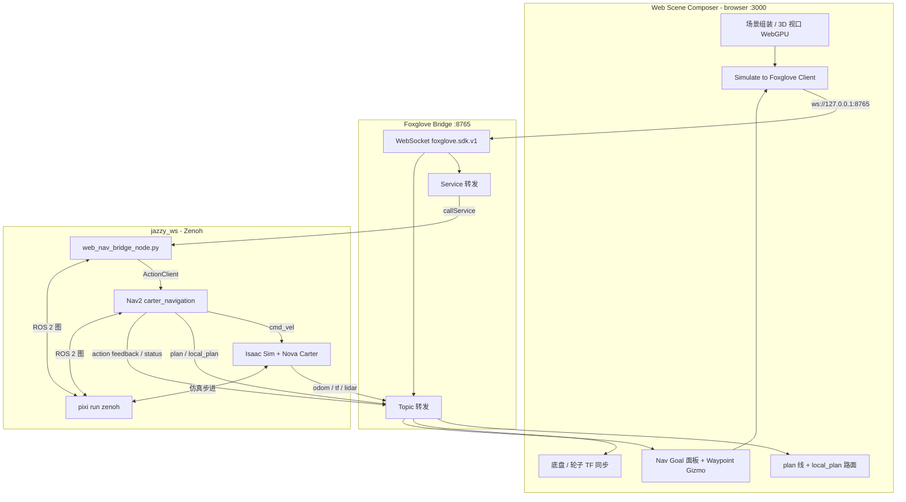

# carter_web_nav_bridge

ROS 2 桥接包：把 **Web Scene Composer** 的导航指令转成 Nav2 Action Goal。  
**不**在桥接里转发 feedback / status —— Web 经 Foxglove 直接订阅 Nav2 action 话题。

源码镜像位于本仓库 `ros/carter_web_nav_bridge/`；实际编译与运行目录为：

```text
C:\IsaacSim-ros_workspaces\jazzy_ws\src\navigation\carter_web_nav_bridge\
```

---

## 端到端架构



### 数据流分层

| 层级 | 组件 | 职责 |
|------|------|------|
| **表现层** | Web Scene Composer | glTF 场景、机器人孪生、导航路径可视化、手柄发 `/cmd_vel` |
| **传输层** | `foxglove_bridge` | WebSocket ↔ ROS 2 话题 / Service / Action（hidden 话题需 `include_hidden`） |
| **命令桥** | `carter_web_nav_bridge` | Web Service → Nav2 `NavigateToPose` Action（仅 goal / cancel） |
| **规划控制** | Nav2 | 全局/局部规划、`/cmd_vel`、lifecycle |
| **仿真** | Isaac Sim | 物理、传感器、里程计、TF |
| **中间件** | Zenoh（`pixi run zenoh`） | Windows 下 ROS 2 节点互通（与 Isaac / Nav2 同图） |

### Web 侧主要话题（经 Foxglove 订阅）

| 话题 | 类型 | 用途 |
|------|------|------|
| `/chassis/odom` | `nav_msgs/Odometry` | 底盘位姿（Simulate） |
| `/tf` | `tf2_msgs/TFMessage` | 轮子 / 万向轮关节 |
| `/plan` 或 `/plan_smoothed` | `nav_msgs/Path` | 全局路径（视口 1px 线） |
| `/local_plan` | `nav_msgs/Path` | 局部路径（视口路面 ribbon） |
| `/navigate_to_pose/_action/feedback` | action feedback | Nav Goal 剩余距离 |
| `/navigate_to_pose/_action/status` | action status | 导航阶段（hidden） |
| `/front_3d_lidar/lidar_points` | `sensor_msgs/PointCloud2` | 雷达点云（可选） |

### Web 侧 Service（经 Foxglove 调用）

| Service | 类型 | 提供者 |
|---------|------|--------|
| `/web_scene_composer/navigate_to_pose` | `carter_web_nav_bridge/srv/NavigateToPose` | **本包** |
| `/web_scene_composer/cancel_navigation` | `std_srvs/srv/Trigger` | **本包** |

---

## Windows 完整启动（推荐顺序）

在 **6 个独立 PowerShell 终端** 中操作。工作目录均为：

```powershell
cd C:\IsaacSim-ros_workspaces\jazzy_ws
```

环境需已激活 `(jazzy_ws)`（pixi / conda 按你本机配置）。

### 终端 1 — Zenoh 中间件（最先）

```powershell
pixi run zenoh
```

保持运行。后续所有 ROS 2 节点依赖同一 Zenoh 路由。

### 终端 2 — Isaac Sim 仿真

```powershell
ros2 launch isaacsim_bringup run_isaacsim.launch.py install_path:=C:/isaacsim-6.0.1
```

启动后在 Isaac Sim 中加载 Nova Carter 场景，点击 **Play** 开始仿真步进。

### 终端 3 — Foxglove Bridge

```powershell
pixi run ros2 run foxglove_bridge foxglove_bridge --ros-args -p include_hidden:=true
```

成功日志示例：

```text
[INFO] [foxglove_bridge]: Server listening on port 8765
```

> `include_hidden:=true` 必须开启，否则 Web 无法订阅  
> `/navigate_to_pose/_action/feedback` 与 `/_action/status`。

### 终端 4 — Nav2

```powershell
ros2 launch carter_navigation carter_navigation.launch.py use_rviz:=False
```

确认 Action Server 就绪：

```powershell
ros2 action info /navigate_to_pose
# 期望：Action servers: 1 (/bt_navigator)
```

### 终端 5 — 本桥接节点

```powershell
ros2 launch carter_web_nav_bridge web_nav_bridge.launch.py
```

确认 Service：

```powershell
ros2 service list | findstr web_scene_composer
```

### 终端 6 — Web Scene Composer（前端）

```powershell
cd C:\OMEN\USD\Web-Scene-Composer
npm install   # 首次
npm run dev
```

浏览器打开 [http://localhost:3000](http://localhost:3000) → 标题栏 **Simulate** 连接 `ws://127.0.0.1:8765`。

### 启动顺序小结

```text
① Zenoh          → ② Isaac Sim (Play)  → ③ Foxglove Bridge
                              ↓
                    ④ Nav2  → ⑤ web_nav_bridge  → ⑥ npm run dev
```

| 步骤 | 命令 | 可否后开 |
|------|------|----------|
| 1 | `pixi run zenoh` | 必须最先 |
| 2 | `run_isaacsim.launch.py` | 可与 3 并行，但需 Play 后才有 odom/tf |
| 3 | `foxglove_bridge` + `include_hidden` | Simulate 前必须已监听 8765 |
| 4 | `carter_navigation` | Nav Goal / 路径话题前必须就绪 |
| 5 | `web_nav_bridge` | 发送导航目标前必须就绪 |
| 6 | `npm run dev` | 任意时刻 |

---

## 本节点在架构中的位置（命令桥）

```text
┌─────────────────────────────────────────────────────────────────────────┐
│ Web Scene Composer                                                       │
│  · Nav Goal：Waypoint Gizmo → map 坐标 → callService                    │
│  · 进度/结果：直接 subscribe Nav2 action 话题（不经本节点）              │
│  · 路径：subscribe /plan、/plan_smoothed、/local_plan                   │
└───────────────┬───────────────────────────────┬─────────────────────────┘
                │ callService                   │ subscribe
                ▼                               ▼
┌───────────────────────────┐     ┌─────────────────────────────────────────┐
│ foxglove_bridge :8765     │     │ /navigate_to_pose/_action/feedback      │
│  · services + topics      │     │ /navigate_to_pose/_action/status        │
└───────────────┬───────────┘     └───────────────────▲─────────────────────┘
                │ callService                         │ publish (Nav2)
                ▼                                     │
┌───────────────────────────────────────────────────┴─────────────────────┐
│ web_nav_bridge_node.py  ← 本包                                           │
│  输入：Web Service   输出：Nav2 Action Goal（异步）                         │
└───────────────────────────────────┬─────────────────────────────────────┘
                                    │ ActionClient send_goal_async
                                    ▼
┌─────────────────────────────────────────────────────────────────────────┐
│ Nav2  /navigate_to_pose  (server: /bt_navigator)                         │
│  → /plan /plan_smoothed /local_plan /cmd_vel → Isaac Sim                 │
└─────────────────────────────────────────────────────────────────────────┘
```

---

## `web_nav_bridge_node.py` 输入与输出

本节点是 **单向命令桥**：只负责「接单 → 发 Action」，进度与结果 **不由本节点回传 Web**。

### 输入（Input）

| 来源 | 接口 | 类型 | 内容 |
|------|------|------|------|
| Web（经 Foxglove） | `/web_scene_composer/navigate_to_pose` | `carter_web_nav_bridge/srv/NavigateToPose` | `geometry_msgs/PoseStamped pose`（`frame_id` 通常为 `map`） |
| Web（经 Foxglove） | `/web_scene_composer/cancel_navigation` | `std_srvs/srv/Trigger` | 空请求，取消当前 goal |

Web 侧构造 pose 的流程：

1. 场景中拖动 **Nav Waypoint**（Gizmo 位置 + 旋转）
2. Three.js 世界坐标 → ROS `map` 坐标（`lib/ros/ros-three-coords.ts`）
3. Foxglove `callService` 编码 CDR（Jazzy `ros2jazzy` 消息定义）发往桥接 service

### 输出（Output）

| 目标 | 接口 | 类型 | 时机 |
|------|------|------|------|
| Nav2 | `/navigate_to_pose` | `nav2_msgs/action/NavigateToPose` | service 回调内 `send_goal_async()`，**非阻塞** |
| Web（同步应答） | service response | `bool success` + `string message` | 仅表示 goal 是否已提交 / 被拒绝，**不**表示导航已结束 |
| 终端日志 | — | — | `feedback_callback` 节流打印剩余距离；`result` 打印 SUCCEEDED/CANCELED/ABORTED |

### 本节点**不**输出（由 Web 直连 Nav2）

| 数据 | 话题 | Web 消费者 |
|------|------|------------|
| 实时反馈（剩余距离等） | `/navigate_to_pose/_action/feedback` | `lib/foxglove/client-manager.ts` → Nav Goal 面板 |
| 导航状态 | `/navigate_to_pose/_action/status` | 同上 |

### 实现要点（方案 B）

- 使用 **`rclpy.action.ActionClient`**，单 Node + 单 executor（`rclpy.spin`）
- **不用** `BasicNavigator`（避免双 Node / 线程 / `Executor is already spinning`）
- `send_goal_async` + `feedback_callback` + `get_result_async`：service 立即返回，导航后台由 executor 驱动
- `cancel_goal_async()` 通过保存的 `goal_handle` 取消

---

## 包结构

```text
jazzy_ws/src/navigation/carter_web_nav_bridge/
├── CMakeLists.txt
├── package.xml
├── srv/NavigateToPose.srv
├── scripts/web_nav_bridge_node.py   ← 桥接节点
└── launch/web_nav_bridge.launch.py
```

Web Scene Composer 侧相关代码：

```text
Web-Scene-Composer/
├── components/panels/nav-goal-panel.tsx
├── components/viewport/nav-path-lines.tsx
├── lib/foxglove/client-manager.ts
├── lib/ros/nav-goal-config.ts
└── ros/carter_web_nav_bridge/README.md   ← 本文档（镜像）
```

---

## 编译

修改本包后：

```powershell
cd C:\IsaacSim-ros_workspaces\jazzy_ws

# 先停掉正在运行的 web_nav_bridge，否则 Windows 可能锁 dll
colcon build --packages-select carter_web_nav_bridge --merge-install
. .\install\setup.ps1
```

Windows launch 通过 `python web_nav_bridge_node.py` 启动（见 `web_nav_bridge.launch.py`），避免 `WinError 193`。

---

## Service 一览

| Service | 类型 | 说明 |
|---------|------|------|
| `/web_scene_composer/navigate_to_pose` | `carter_web_nav_bridge/srv/NavigateToPose` | 提交 `PoseStamped` → 异步发送 Nav2 Action |
| `/web_scene_composer/cancel_navigation` | `std_srvs/srv/Trigger` | 取消当前 goal（`cancel_goal_async`） |

---

## 故障排查

| 现象 | 原因 | 处理 |
|------|------|------|
| Web Simulate 连不上 `ws://127.0.0.1:8765` | Bridge 未启动或 IPv6 `localhost` | 用 `127.0.0.1`；确认终端 3 在跑 |
| `ros2 action info /navigate_to_pose` → **Action servers: 0** | Nav2 未启动或已崩溃 | 重启终端 4 `carter_navigation` |
| `controller_server IS DOWN` / `map_server IS DOWN` | lifecycle 心跳丢失（仿真暂停、CPU、Zenoh） | 确认 Isaac **Play**；检查终端 1 Zenoh |
| Web `服务调用超时` | bridge 未运行或 Nav2 挂掉 | `ros2 service list \| findstr web_scene`；`ros2 action info` |
| Nav Goal 无剩余距离 | 未 `include_hidden` | 重启 foxglove_bridge 并带 `-p include_hidden:=true` |
| `/plan` / `/local_plan` 无数据 | 未在导航或 Nav2 异常 | 发送 goal 后检查；`ros2 topic echo /local_plan --once` |
| TF 只有 `odom→base_link` 无 `map→odom` | `map_server`/定位未工作 | 重启 Nav2；确认地图与 AMCL |
| `/chassis/odom` 不动 | Isaac 未 Play 或 Zenoh 断连 | 检查终端 1、2 |

**桥接节点只转发 goal，不能修复 Nav2 崩溃。** 正常时应看到 `Action servers: 1 (/bt_navigator)`。

---

## 与旧版（BasicNavigator + 线程）的区别

| | 旧版 | 方案 B（当前） |
|--|------|----------------|
| 发 goal | `BasicNavigator.goToPose()` 阻塞线程 | `ActionClient.send_goal_async()` |
| cancel | 与 `goToPose` 抢锁，易失效 | `goal_handle.cancel_goal_async()` |
| feedback 给 Web | 无（靠 Foxglove 订话题） | 仍无；Web 直连 action 话题 |
| executor | 双 Node / 线程 spin 风险 | 单 Node 单 spin |

---

## 相关文档

- Web 端总览：[Web-Scene-Composer/README.md](../../README.md)
- Foxglove 地址：`lib/ros/foxglove-config.ts` → `ws://127.0.0.1:8765`
- Nav2 Path 消息：[nav_msgs/Path](https://docs.ros.org/en/ros2_packages/rolling/api/nav_msgs/msg/Path.html)
